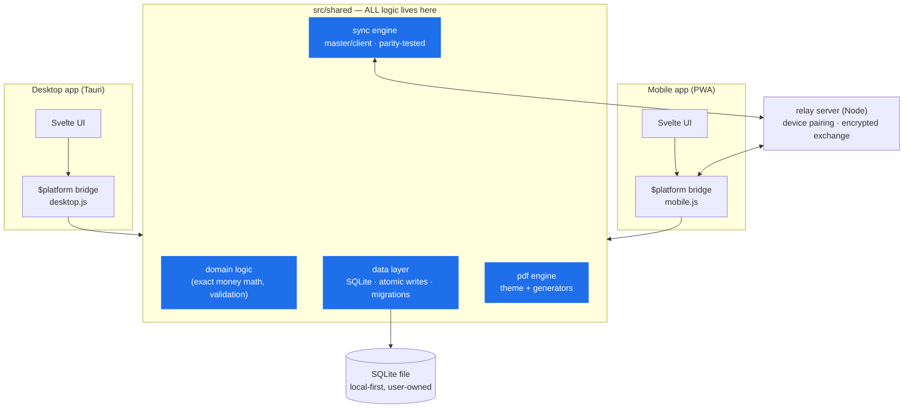
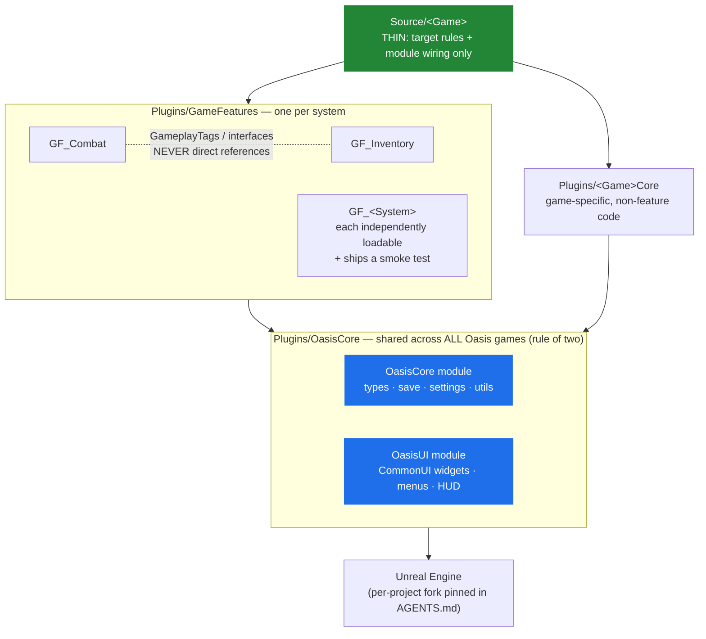

# OGDK — Oasis Games Dev Kit

**Oasis Games LLC.** The reusable foundation for every project — so starting a new app
or game is an art workload, not a stack-building workload.

> ## 🆕 New here? Start with **[GETTING-STARTED.md](./GETTING-STARTED.md)**
> The 15-minute onboarding: clone → run the environment self-test
> (`.\tools\gate.ps1` / `./tools/gate.sh` must print **GATE PASSED**) → run the
> **agent conflict check** before letting YOUR AI tools loose here (your global
> agent configs can silently fight this repo's rules — the guide shows you how
> to detect and defuse that) → first session + how to contribute.
> Collaborators: PRs welcome, especially [LESSONS.md](./LESSONS.md) entries —
> breaking this kit politely is how it gets stronger.

Two tracks on one shared process:

```
OGDK/
├── docs-template/      # the session-chain process every project gets (model-agnostic)
├── tools/              # PATH-health + clean-launch scripts, new-project scaffolder
├── skills/             # agent skills: session-start, session-end, plan-writer
├── checklists/         # new-project + pre-commit gates
├── app/                # APP track — web / local / mobile (Tauri + Svelte + relay)
└── game/               # GAME track — Unreal Engine, modular & performance-first
```

## Start a new project

```powershell
.\tools\new-project.ps1 -Name "MyProject" -Type App   # or -Type Game
```

This copies `docs-template/` + the track's templates into a fresh dir, renames
`*.template.md`, and git-inits. Then fill in the marked sections of `AGENTS.md`
(invariants, gates) and you're building.

## The process (what makes this work across models/accounts/devs)

Every project runs the same session chain — any AI model or human follows it cold:

```
docs/00-START-HERE.md → AGENTS.md → docs/STATUS.md → active plan → role guide
```

- **AGENTS.md** — non-negotiable rules (one per project; CLAUDE.md is just a pointer to it)
- **STATUS.md** — the living handoff, updated at the end of every session
- **plans/** — design before code; completed plans graduate into `core/` specs
  (lifecycle: `docs-template/DOCUMENTATION-VERSIONING-GUIDE.md`)

## Rules of the kit

1. **OGDK holds process + proven patterns, never app/game domain logic.**
2. **Rule of two** — code modules enter `app/packages/` or `game/` plugins only after a
   second project needs them. Until then they live in their origin project.
3. **Templates are starting points, not synced dependencies.** Projects diverge freely;
   only `tools/` scripts and `skills/` are updated in place (improvements flow back here).
4. **Windows hazard:** never launch AI agents from MSYS2 / Git Bash / WSL — NTFS write
   corruption. `tools/verify-path-health.ps1` must pass first. Always.

## Track guides

- [app/STACK.md](./app/STACK.md) — the web/local/mobile stack, proven in the origin app
- [game/STACK.md](./game/STACK.md) — Unreal architecture: thin game, plugin modules, perf budgets

## Framework maps

### App track — shared-core architecture



**The one rule:** platform apps never duplicate shared code — differences are injected
through the `$platform` bridge, never `if (isMobile)` checks inside shared modules.
Desktop is authoritative for contested data (e.g. document numbers).

### Game track — modular Unreal architecture



**The one rule:** dependencies point one way — Game → GameFeatures → OasisCore → Engine.
Features talk via GameplayTags/interfaces, never to each other directly. C++ for systems,
Blueprint at the edges; tick off by default; soft references for heavy content.
