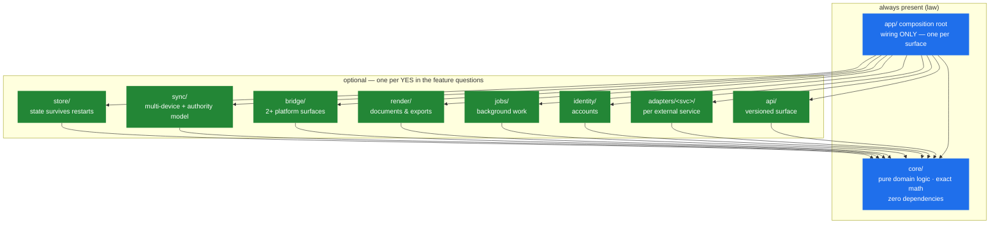
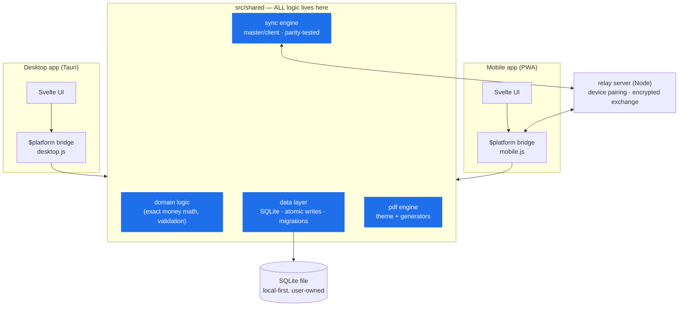
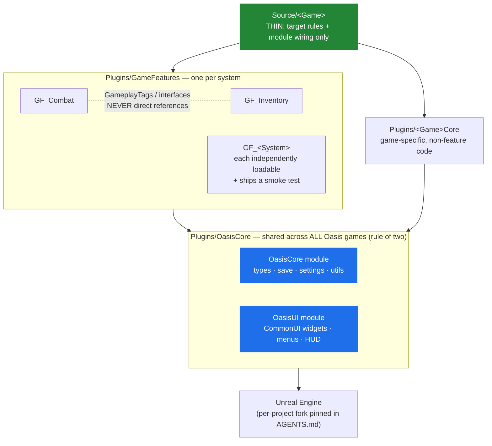

# OGDK — Oasis Games Dev Kit

**Oasis Games LLC.** The reusable foundation for every project — so starting a new app
or game is an art workload, not a stack-building workload.

> ## 🆕 New here? Pick your door
>
> **"I have an idea — let me build."** → **[START-BUILDING.md](./START-BUILDING.md)**
> The shortest path from zero to a running project: one setup command
> (`bootstrap`), pick a shape for your app, and your AI agent builds it *while
> explaining how the code works*. No jargon required up front — the guardrails stay
> out of your way until one actually catches something. This is the door for someone
> with great ideas and little or no coding experience.
>
> **"I want to run or improve the kit itself."** → **[GETTING-STARTED.md](./GETTING-STARTED.md)**
> The complete ~20-minute walkthrough, assuming zero experience: install git → clone →
> run the self-test (`.\tools\gate.ps1` must print **GATE PASSED**) → the **agent
> conflict check** before letting YOUR AI tools loose here → first session → PRs.
> Then [AGENTS.md](./AGENTS.md) is the law and [BOUNDARY.md](./BOUNDARY.md) the privacy
> membrane. Collaborators: contributions welcome, especially [LESSONS.md](./LESSONS.md)
> entries — breaking this kit politely is how it gets stronger.

## What makes this kit different

Most starter kits are templates. This one is a **process organism** — built by
rotating AI models and humans across machines and operating systems, and shaped
by every failure that survived contact with that reality:

- **Any session picks up cold.** The session chain (START-HERE → AGENTS →
  STATUS → plan) is the entire memory — no chat history is ever load-bearing.
  Proven across vendors: a different model reconstructed full project state
  from the chain alone.
- **"Did I break it?" is one command.** THE GATE chains integrity, doc
  coverage, and the project's own tests/builds — exit 0 or no commit. The
  integrity layer detects the corruption classes we've ACTUALLY been bitten by,
  including truncation that hides inside a comment and passes syntax checks
  (EOF sentinels), zero-filled tails, and stale-mount writes.
- **The kit learns.** Friction gets captured (`LESSONS.md`), a retro skill
  codifies it into rules/scripts/skills with human approval, and the gates
  verify it never recurs. Decisions *declined* are recorded too, so they stay
  declined instead of being re-litigated by the next session.
- **Cross-platform is enforced, not aspirational.** Every tool ships as a
  `.ps1`/`.sh` twin pair (same behavior, same commit), validated on Windows
  PowerShell 5.1 and GNU/Linux both.
- **Tools carry provenance.** Projects are stamped with the kit commit their
  tools came from (`KIT-VERSION`, printed at session start); one command
  updates the whole fleet, byte-verified.
- **The boundary is mechanical.** What may enter the kit and what never does
  (project IP, personal data, collaborator code) is policy ([BOUNDARY.md](./BOUNDARY.md))
  backed by a gate check that scans for each owner's private markers — and
  reports only indexes, never the markers themselves.
- **Agent tooling is governed, not ad hoc.** MCP servers are sanctioned per
  repo sensitivity tier (open / normal / restricted), with host-shell servers
  as the audited escape hatch for sandboxed sessions
  ([docs-template/workflow/MCP.md](./docs-template/workflow/MCP.md)).

Three tracks on one shared process:

```
OGDK/
├── docs-template/      # the session-chain process every project gets (model-agnostic)
├── tools/              # gates, scaffolder, fleet propagation — all .ps1/.sh twins
├── templates/          # project-level config templates (mcp.json — grows by rule of two)
├── skills/             # agent skills: session-start/end, plan-writer, kit-retro, repo-study
├── checklists/         # new-project + pre-commit gates
├── app/                # APP track — feature-driven skeletons (Tauri + Svelte preset proven)
└── game/               # GAME track — Unreal Engine, modular, perf-first, port-aware
```

The third is the **Python-sim / Embedded** track — CAN firmware, sensors, smart probes, and
simulation. Its guide is
[`docs-template/core/python-simulation.md`](./docs-template/core/python-simulation.md); it reuses the
App-track `core/` shape rather than a separate top-level dir.

## Start a new project

```powershell
.\tools\new-project.ps1 -Name "MyProject" -Type App   # or -Type Game
```

This copies `docs-template/` + the track's templates into a fresh dir, renames
`*.template.md`, and git-inits. Then fill in the marked sections of `AGENTS.md`
(invariants, gates) and you're building.

## The process (what makes this work across models/accounts/devs)

Every project runs the same session chain — any AI model or human follows it cold:

```
docs/00-START-HERE.md → AGENTS.md → docs/STATUS.md → active plan → role guide
```

- **AGENTS.md** — non-negotiable rules (one per project; CLAUDE.md is just a pointer to it)
- **STATUS.md** — the living handoff, updated at the end of every session
- **plans/** — design before code; completed plans graduate into `core/` specs
  (lifecycle: `docs-template/DOCUMENTATION-VERSIONING-GUIDE.md`)

## Rules of the kit

1. **OGDK holds process + proven patterns, never app/game domain logic.**
2. **Rule of two** — code modules enter `app/packages/` or `game/` plugins only after a
   second project needs them. Until then they live in their origin project.
3. **Templates are starting points, not synced dependencies.** Projects diverge freely;
   only `tools/` scripts and `skills/` are updated in place (improvements flow back here).
4. **Windows hazard:** never launch AI agents from MSYS2 / Git Bash / WSL — NTFS write
   corruption. `tools/verify-path-health.ps1` must pass first. Always.

## Track guides

- [app/STACK.md](./app/STACK.md) — the web/local/mobile stack, proven in the origin app project
- [game/STACK.md](./game/STACK.md) — Unreal architecture: thin game, plugin modules, perf budgets

## Framework maps

### App track — composable feature-driven skeletons

Answer the feature questions in [app/APP-ARCHITECT.md](./app/APP-ARCHITECT.md);
each YES adds a green module, each NO deletes one. Blue is law in every app.
Skeletons are generated per [docs-template/CODE-CONVENTIONS.md](./docs-template/CODE-CONVENTIONS.md);
the annotated quality bar lives at [app/exemplar/](./app/exemplar/README.md).



**The one rule:** every arrow points toward `core/`, never away — the same one-way
dependency law the game track lives by. The proven local-first multi-surface combo
below is Preset A of this map, grown to production:

### App track — the proven Preset A (shared-core architecture)



**The one rule:** platform apps never duplicate shared code — differences are injected
through the `$platform` bridge, never `if (isMobile)` checks inside shared modules.
Desktop is authoritative for contested data (e.g. document numbers).

### Game track — modular Unreal architecture



**The one rule:** dependencies point one way — Game → GameFeatures → OasisCore → Engine.
Features talk via GameplayTags/interfaces, never to each other directly. C++ for systems,
Blueprint at the edges; tick off by default; soft references for heavy content.
