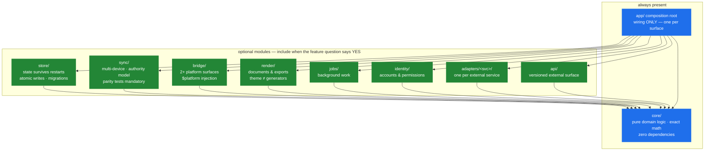

# APP-ARCHITECT — feature-driven skeletons for the app track

You describe the features; this guide assembles the leanest correct skeleton.
The proven local-first combo (see [STACK.md](./STACK.md)) is **Preset A** here —
one option, not the only path. Language-specific code is **generated, not stored**
(see `docs-template/CODE-CONVENTIONS.md` §4); this guide chooses WHAT exists,
conventions govern HOW it's shaped, the exemplar (`../app/exemplar/`) shows the bar.

## How to use (operator or agent)

1. Answer the feature questions (§1) honestly — "no" deletes whole modules.
2. Read off the module set (§2) and pick/compose a preset (§3).
3. Generate the skeleton in the chosen language per CODE-CONVENTIONS §4:
   composition root + module stubs + test stubs, annotated headers pre-filled,
   gate green BEFORE feature code.

## 1. The feature questions

| Question | If YES | If NO |
|----------|--------|-------|
| Does state survive restarts? | Local Store module | skip persistence entirely |
| Do users own their data (no cloud requirement)? | local-first store (file/SQLite) | hosted DB module |
| Multiple devices/users on the same data? | Sync module + **authority model decided day one** | skip sync — biggest scope saving available |
| More than one platform surface (desktop+mobile+web)? | Shared Core + Platform Bridges | single app, no bridge layer |
| Money/measurements/anything precise? | Exact-Math module (non-negotiable invariant) | — |
| Produce documents/exports (PDF/CSV/printables)? | Render module (theme/primitives split from generators) | skip |
| Long-running/background work? | Jobs module (queue + status surface) | keep everything request-shaped |
| Accounts/permissions? | Identity module (buy-don't-build the auth itself) | skip — hugely simplifying |
| Talks to third-party services? | one Adapter module PER service (never inline calls) | skip |
| Needs an API for others? | API Surface module (versioned from day one) | internal calls only |

## 2. Module catalog

Every module: one directory, annotated header, mirrored test file, declared
`@boundary`. The **pure core** (domain logic, exact math, transforms) is always
present and always dependency-free — everything else is optional shell.

```
core/        domain logic, exact math, validation      — pure, zero deps, exhaustive tests
store/       persistence + migrations + atomic writes  — if state survives restarts
sync/        replication, authority, conflict policy   — if multi-device; parity tests mandatory
bridge/      per-platform injection ($platform pattern)— if multiple surfaces
render/      documents/exports (theme ≠ generators)    — if documents
jobs/        background work, queues, status           — if long-running work
identity/    auth integration, sessions, permissions   — if accounts
adapters/<x>/ one per external service                 — if third parties
api/         versioned external surface                — if serving others
app/         composition root(s) — wiring ONLY         — always (one per surface)
```

Boundary law (the app track's one-way rule): `app → {everything} → core`;
`core` depends on nothing; modules never depend on siblings except through
interfaces declared in `core`. Sound familiar? It's the game track's dependency
rule wearing different clothes — one architecture, two tracks.

## 3. Presets (compositions that earn their keep)

- **A — Local-first multi-surface** (the proven combo): core + store + sync +
  bridge ×N + render. The full battle-tested shape; pick when users own data
  across devices. Reference implementation exists (origin app, private).
- **B — Service/API**: core + store + api + adapters + jobs. No bridges, no sync
  (the server IS the authority).
- **C — CLI/tooling**: core + app, optionally store. The smallest honest program;
  most "scripts" should be this instead.
- **D — Web app**: core + store-or-api + app(web). Add bridge only when a second
  surface actually arrives — not before.
- **E — Single-surface desktop**: A minus sync minus extra bridges. The starter
  most projects should pick; A is what some grow into.

Presets compose: B+D (service + its frontend) is two skeletons sharing `core/`
via a package, not one mega-app.

## 4. Invariants vs. choices (be honest about which is which)

**Law in every combination:** exact math · durable writes · declared boundaries ·
composition-root-only wiring · test-per-module · the gate.
**Choices the origin app made (replaceable):** Svelte, Tauri, SQLite, a relay
server, Node tooling. Respect them as proven; don't mistake them for law.

## 5. The composable map



Blue = law (every app). Green = opt-in per feature answer. All arrows point
toward `core` — never away from it.

---

## 6. Scaffolder Feature Mapping Design (Roadmap Follow-Up)

To prevent boilerplate rot, language-specific code is generated on-demand by the AI agent, while the kit's scaffolding tools orchestrate the correct module directory structures. Future updates to the scaffolder (`new-project.ps1` / `new-project.sh`) will introduce a `-Features` flag to map feature requirements directly to initial code structures.

### Flag Syntax and Composition
- **Argument:** `-Features <module1,module2,...>` (Linux: `-f <module1,module2,...>`) or `-Preset <A|B|C|D|E>` (Linux: `-p <A|B|C|D|E>`).
- **Interactive Fallback:** If scaffolding an `App` type without `-Features` or `-Preset`, the tool will offer an interactive CLI checkbox prompt to select desired features.

### Scaffolder Directory and Stub Generation Map

When specific features/modules are enabled, the scaffolder generates the matching directories under the project's source root (e.g. `src/`) and seeds them with baseline stubs containing structural annotations:

1. **`store` (Local persistence)**
   - **Path:** `src/store/`
   - **Baseline Stub:** `src/store/store.ts` (or equivalent language extension).
   - **Annotation:** `@intent: durable atomic persistence layer with migrations; @boundary: core domain logic has no direct access to store.`

2. **`sync` (Multi-device replication)**
   - **Path:** `src/sync/`
   - **Baseline Stub:** `src/sync/sync.ts`
   - **Annotation:** `@intent: multi-device synchronization and replication; @invariant: conflict resolution and authority policies defined on day one.`

3. **`bridge` (Multi-platform integration)**
   - **Path:** `src/bridge/`
   - **Baseline Stub:** `src/bridge/bridge.ts`
   - **Annotation:** `@intent: platform surface abstraction ($platform pattern); @boundary: platform-specific code calls pure core through interfaces.`

4. **`render` (Documents/exports generation)**
   - **Path:** `src/render/`
   - **Baseline Stub:** `src/render/render.ts`
   - **Annotation:** `@intent: documents and exports generator; @invariant: presentation themes must remain separate from core generation primitives.`

5. **`jobs` (Background processing)**
   - **Path:** `src/jobs/`
   - **Baseline Stub:** `src/jobs/jobs.ts`
   - **Annotation:** `@intent: background work queue and task worker loop; @boundary: job processing runs asynchronously without blocking main thread.`

6. **`identity` (Authentication/Authorization)**
   - **Path:** `src/identity/`
   - **Baseline Stub:** `src/identity/identity.ts`
   - **Annotation:** `@intent: sessions, permissions, and third-party identity management; @risk: buy-don't-build the cryptography or protocol handling.`

7. **`adapters` (Third-party services)**
   - **Path:** `src/adapters/`
   - **Baseline Stub:** `src/adapters/README.md`
   - **Annotation:** `@intent: integration adapters; @boundary: one separate folder per external service; zero inline integration calls inside core.`

8. **`api` (External interface surface)**
   - **Path:** `src/api/`
   - **Baseline Stub:** `src/api/api.ts`
   - **Annotation:** `@intent: versioned public external API or IPC surface; @invariant: API versioning must be decoupled from internal core changes.`

## Local-first patterns (study-derived, 2026-06-14)

Proven patterns for the local-first app preset (see [STACK.md](./STACK.md)). Distilled
from external study (actualbudget/actual, FocusCookie/tauri-sqlite-example, pubkey/rxdb).

- **Platform isolation.** Keep business / query / state logic in a platform-agnostic
  core; inject desktop / mobile / server differences through a bridge (`#platform` /
  `#server`), never with `if (platform)` branches inside the core or UI.
- **Local database.** Run schema migrations on the **native/Rust side at startup**;
  expose data only through backend commands. **Decline** frontend-issued raw SQL — it
  re-couples the UI to the schema.
- **Reactive cleanup.** Auto-dispose database subscriptions with `FinalizationRegistry`
  / `WeakRef` so unmounted UI can't leak listeners.
- **Shared sync (rule-of-two candidate).** Offline-first sync = a Hybrid Logical Clock
  + Merkle-trie diffing. When a **second** app needs it, extract to
  `app/packages/@oasis/local-first-sync` rather than reimplementing — never extract
  speculatively for the first consumer.

