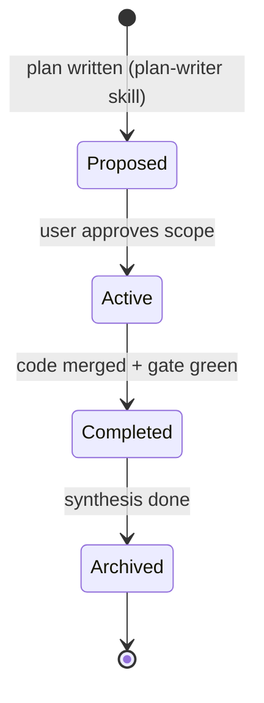

# Documentation Versioning & Lifecycle Guide

How documentation is versioned, named, and moved through its lifecycle in this
project. Project-agnostic: the same rules apply to every Oasis project, app or game
track. The session chain (00-START-HERE.md) governs *when* docs are touched; this
guide governs *how they evolve*.

---

## 1. Core principles

1. **Docs as code.** Documentation lives in this repo under `docs/`. A change to an
   architectural spec, schema, or contract is committed in the SAME commit as the
   code change it describes.
2. **Explicit lifecycle.** A design starts as a plan, ships as code, and is then
   synthesized into living specs. No doc is ambiguous about which stage it is in.
3. **Traceability.** Every significant change to a schema, protocol, or API
   references the plan where the decision was made (path or commit hash).

---

## 2. Document types & folder structure

```
docs/
├── 00-START-HERE.md                    # session chain entry point
├── STATUS.md                           # living handoff (one screen max)
├── DOCUMENTATION-VERSIONING-GUIDE.md   # this guide
├── LESSONS.md                          # learning-loop capture buffer
├── core/                               # living specs: architecture, schemas, domain rules
├── presentation/                       # living specs: UI / UX / platform wrappers
├── adapters/                           # living specs: integrations, protocols, relays
├── workflow/                           # operational guides: releases, parity, ops
├── reference/                          # SDK tier: one polished page per shipped component
│   └── COVERAGE.md                     # the manifest — THE index of reference pages
└── plans/                              # implementation plans (immutable once Active)
    └── archive/                        # completed plans (history)
```

- **Living specs** (`core/`, `presentation/`, `adapters/`): reflect the CURRENT state
  of the system. Updated in the same commit as the code they describe.
- **Operational guides** (`workflow/`): actionable how-tos for releasing, syncing,
  and operating the project.
- **Reference** (`reference/`): consumer-facing pages per shipped component — see
  `reference/README.md` and the graduation rule.
- **Plans** (`plans/`): immutable snapshots of a design BEFORE implementation,
  including options rejected and why.

---

## 3. The plan lifecycle (one vocabulary, kit-wide)

Matches the plan-writer skill exactly — these are the only states:



1. **Proposed** — written via the plan-writer skill, registered in STATUS.md
   §Active plans. May still change freely.
2. **Active** — approved; now an immutable snapshot. Disagreement with an Active
   plan = a NEW plan that supersedes it, never an in-place edit.
3. **Completed** — the code shipped and the gate is green. Not yet archived.
4. **Archived** — synthesis is done: content merged into the living specs
   (`core/` etc.), **reference pages created/updated for every shipped component**
   (the graduation rule — `reference/README.md`), THEN the file moves to
   `plans/archive/`. No reference page, no archive.

---

## 4. Naming conventions

| Document type | Format | Example |
| :--- | :--- | :--- |
| Process docs / roadmap | `UPPERCASE-WITH-HYPHENS.md` | `ROADMAP.md`, `STATUS.md` |
| Implementation plan | `<FEATURE>-PLAN.md` (or dated: `YYYY-MM-DD-kebab-plan.md`) | `PHASE1-SIM-PLAN.md` |
| Living spec / reference page | `kebab-case.md` | `architecture.md`, `cdma-core.md` |

---

## 5. Versioning rules for schemas & protocols

Where the project has a database schema, wire protocol, or public API:

### A. Schema migrations
Every schema change is documented in a changelog inside the owning spec in
`core/`, recording: the migration/version number, the DDL or structural change,
any data-upgrade actions, and the plan that decided it.

### B. Protocol / payload versioning
Versioned payloads carry a top-level version tag (e.g. `{ "v": 1, ... }`). A
breaking field change increments the version and documents the
backward-compatibility handling in the owning `adapters/` spec. Units and
precision rules (timestamps, currency, fixed-point) are stated explicitly in the
spec and never silently changed — precision invariants belong in AGENTS.md.

---

## 6. Formatting & quality checklist

Every doc added to `docs/` meets these checks before its commit:

- [ ] **Zero placeholders** — no `TODO`, `TBD`, or empty code blocks in living
      specs or reference pages (plans in Proposed state may carry open questions).
- [ ] **Relative links only** — cross-references use relative markdown links;
      never absolute local paths (they break on every other machine).
- [ ] **Diagrams as Mermaid** — multi-step flows and state machines are Mermaid
      blocks, not external images.
- [ ] **Callouts for the load-bearing parts** — `> [!NOTE]` / `> [!IMPORTANT]`
      blockquotes mark critical assumptions and irreversible decisions.
- [ ] **Self-contained** — a reader with zero session context can act on the doc
      without opening a chat transcript. If it isn't in the repo, the next session
      doesn't know it.
