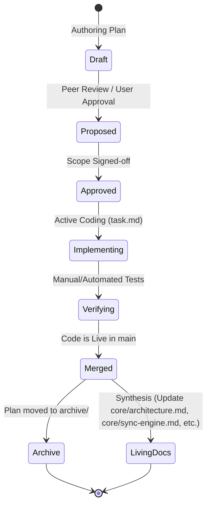

# Documentation Versioning & Lifecycle Guide

This guide establishes the versioning protocols, naming standards, and lifecycle transitions for software documentation across projects (such as **the origin app** and **WyeR**). It ensures that design intentions, database changes, and APIs remain synchronized with the actual codebase status.

---

## 1. Core Principles

1.  **Docs as Code:** Documentation must live in the project's git repository (under `docs/`). Changes to architectural specs or API contracts must be committed in the same pull request/commit as the code changes.
2.  **Explicit Lifecycles:** Documentation is not static. It transitions from a proposal (Implementation Plan) to an active spec, and finally is synthesized into core architecture files once completed.
3.  **Traceability:** Every major change to the database schema (`schema.sql`), APIs, or network telemetry must reference the design document where the decision was made.

---

## 2. Document Types & Folder Structure

All documentation is stored in the project root under `/docs/`.

```
docs/
├── ROADMAP.md               # Future high-level vision and phases
├── DOCUMENTATION-VERSIONING-GUIDE.md # This guide
├── core/                    # Core architectural & system specs
│   ├── architecture.md      # System architecture, capabilities & sandbox boundaries
│   └── sync-engine.md       # Master-client sync pipeline & parity rules
├── presentation/            # User Interface & Platform wrappers
│   └── mobile-ui.md         # Mobile UI design, layouts, views & offline flows
├── adapters/                # Network adapters & connection relays
│   └── link-relay.md        # Relay endpoints, websocket connections & security pairing
├── workflow/                # Operational and development guides
│   ├── GIT.md               # Git commands, releases & version bump pipelines
│   └── UPDATER.md           # Tauri auto-updater configuration
└── plans/                   # Feature implementation plans
    └── archive/             # Completed/historical plans
```

### Document Categorization:
*   **Core / System Specs (`/docs/core/`, `/docs/presentation/`, `/docs/adapters/`):** Living documents reflecting the *current state* of the production app's architecture, UI, and communications.
*   **Operational Guides (`/docs/workflow/`):** Actionable workflows for releases, auto-upgrades, and testing.
*   **Implementation Plans (`/docs/plans/`):** Immutable snapshots of a feature's design *prior* to implementation. They record historical choices, options rejected, and original testing protocols. Once merged, they are archived.

---

## 3. The Implementation Plan Lifecycle

Implementation plans must follow a structured lifecycle to prevent the documentation directory from becoming cluttered with stale or contradictory drafts:



### Lifecycle States:

1.  **Draft (`[feature_name]_plan.md`):** Being actively written. Contains open questions and placeholder items.
2.  **Proposed:** Shared with the user or team for feedback. Features the `User Review Required` alert callouts.
3.  **Approved:** Sign-off complete. Ready for implementation.
4.  **Archive / Synthesis:** Once the code is merged and verified:
    *   The raw implementation plan is moved to `/docs/plans/archive/` to serve as a history log.
    *   Any new schemas, APIs, or architectural decisions are **synthesized** and merged into the appropriate living documents (e.g., `/docs/core/architecture.md`, `/docs/core/sync-engine.md`, or `/docs/adapters/link-relay.md`) so they remain the single source of truth for the codebase.

---

## 4. Document Naming Conventions

To ensure documents are easily sortable and readable, use the following naming standards:

| Document Type | Standard Format | Example |
| :--- | :--- | :--- |
| **Global Guide / Roadmap** | `UPPERCASE-WITH-HYPHENS.md` | `ROADMAP.md` |
| **Staged Plan** | `YYYY-MM-DD-kebab-case-plan.md` | `2026-06-09-plaid-link-staging-plan.md` |
| **Walkthrough** | `YYYY-MM-DD-kebab-case-walkthrough.md` | `2026-06-09-wyer-mobile-walkthrough.md` |
| **System Spec / Guide**| `kebab-case.md` | `architecture.md`, `sync-engine.md`, `link-relay.md` |

---

## 5. Versioning Rules for Database & API Specs

Because database schemas and network telemetry evolve, special protocols apply to keeping them documented:

### A. Database Migrations
*   Every change to `schema.sql` must be documented in a changelog inside `/docs/core/architecture.md` (or the respective module's schema design section).
*   Specify:
    1.  **Migration Version** (e.g., `user_version = 4`).
    2.  **SQL Statement DDL** changes.
    3.  **Data upgrade actions** (e.g., converting null columns, migrating payloads).
    4.  **Linked Plan** matching the feature.

### B. Network Protocol Versioning
For LAN communication (e.g., between **the origin app-mobile** and desktop):
*   Payloads must include a top-level version tag: `{ "v": 1, "data": { ... } }`.
*   If a breaking field change occurs (e.g. changing `clientId` to `client_uuid`), increment the payload version and document the backward-compatibility handler inside `/docs/adapters/link-relay.md`.

---

## 6. Document Formatting & Quality Checklist

Every document added to `/docs/` must meet the following validation checks:
*   [ ] **Zero Placeholders:** No `TODO`, `TBD`, or empty code snippets.
*   [ ] **Relative Linkages:** Cross-referenced files must use relative file markdown links (e.g., `[schema.sql](../src/.../schema.sql)`) rather than hardcoded local workspace absolute paths.
*   [ ] **Mermaid Visuals:** Use standard Mermaid diagrams for multi-client workflows or state changes.
*   [ ] **GitHub Alerts:** Use proper markdown blockquotes (`> [!NOTE]`, `> [!IMPORTANT]`) for critical design assumpt
